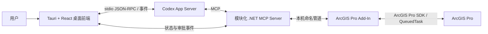

# ArcGIS Pro 智能助手桌面软件设计规格

- 日期：2026-07-19
- 状态：总体设计已确认，待书面规格确认
- 工作名称：ArcGIS Pro Agent（后续可更名）
- 首版范围：Windows 本机单用户、ChatGPT 订阅账号登录、ArcGIS Pro 3.7

## 1. 背景与问题

现有 `nicogis/MCP-Server-ArcGIS-Pro-AddIn` 已证明可以通过 MCP 调用 ArcGIS Pro，但它目前更接近示例工程：工具数量少、服务端与 Add-In 的能力不完全一致、ArcGIS Pro 安装路径被硬编码，且缺少独立前端、账号登录、权限确认、运行诊断和可维护的安装/卸载体验。

本项目将在保留“LLM → MCP → ArcGIS Pro Add-In”核心思路的基础上，建设一个类似 Locus 的独立 Windows 软件。用户在同一个界面中登录 ChatGPT 订阅账号、与智能助手对话、查看当前 ArcGIS Pro 上下文、审核高风险操作，并能清楚找到程序、配置、日志、源代码和卸载入口。

## 2. 目标

首版必须实现以下目标：

1. 以 Tauri 桌面软件承载对话、ArcGIS 上下文、工具调用过程、审批和诊断。
2. 使用 OpenAI 官方 Codex App Server 接入 ChatGPT 订阅账号，不抓取浏览器 Cookie，不要求 API Key。
3. 通过独立、模块化的 .NET MCP Server 和 ArcGIS Pro Add-In 安全调用 ArcGIS Pro SDK。
4. 覆盖日常 GIS 工作的读取、选择、制图、分析、导出和受控编辑，并让功能易于添加、禁用、修改和删除。
5. 所有会创建文件、修改工程或数据的操作都可预览、可确认、可审计；可恢复时优先提供撤销或备份。
6. 本机开发版本可稳定安装和移除；代码结构为后续打包分发和接入其他 LLM 预留清晰边界。

## 3. 非目标

首版不包含：

- 云端多用户、团队协作或远程控制 ArcGIS Pro。
- API Key 或按量计费模型接入。
- 任意 Python、PowerShell、SQL 或系统命令执行。
- 绕过 ArcGIS Pro SDK、ArcGIS 权限体系或数据源权限。
- 自动发布到公众下载渠道、自动更新服务或代码签名体系。
- 完整复刻 ArcGIS Pro 的全部按钮；低频工具通过受控地理处理注册表逐步扩展。

## 4. 已批准的总体架构



### 4.1 桌面前端

- 技术：Tauri、React、TypeScript。
- 职责：窗口和生命周期管理、ChatGPT 登录引导、会话界面、工具事件展示、风险审批、ArcGIS 上下文、设置、日志和安装诊断。
- Tauri 后端负责启动、监控和停止子进程，前端页面不直接执行本机命令。
- 前端仅通过带类型的命令和事件与 Tauri 后端交互。

### 4.2 Codex 运行时适配器

- 首版唯一实现为 Codex App Server，通过官方 ChatGPT 登录流程使用订阅账号。
- 桌面端管理 App Server 的启动、初始化、登录状态、线程/会话、流式消息、工具审批和异常重连。
- 内部定义 `AgentRuntime` 抽象，使未来可以增加其他 LLM 运行时，但首版不为尚未支持的模型制作界面或兼容代码。
- 不模拟 ChatGPT 网页，不读取或复制 OpenAI 登录令牌；凭据由官方 Codex 运行时管理。

### 4.3 .NET MCP Server

- 作为独立本机进程运行，向 Codex App Server 暴露 MCP 工具。
- 负责工具发现、参数校验、权限等级、调用编排、超时/取消、结构化结果和审计记录。
- 不引用 ArcGIS Pro UI 线程对象，不直接操作工程；所有 ArcGIS 操作通过版本化的桥接协议交给 Add-In。
- 工具按模块注册，单个模块可以独立启用、禁用和测试。
- 与 Tauri 后端之间的控制通道只传递健康状态、进度和待审批请求，不能绕过 MCP 工具契约直接调用 ArcGIS 操作。

### 4.4 ArcGIS Pro Add-In

- 使用 C# 和 ArcGIS Pro SDK，运行在 ArcGIS Pro 进程内。
- 负责读取当前工程、地图、图层和选择集，并在正确的 ArcGIS 线程模型中执行 SDK 操作。
- 与 MCP Server 使用仅限本机、单实例、可鉴权的命名管道通信。
- 所有请求都有操作 ID、协议版本、超时和结构化错误；断开时不阻塞 ArcGIS Pro。
- 提供连接状态按钮/面板，但不把日常聊天界面塞入 ArcGIS Pro。

### 4.5 版本化共享契约

- 请求、响应、事件、错误码和能力清单位于独立 `contracts` 项目。
- MCP Server 与 Add-In 启动握手时交换协议版本、ArcGIS Pro 版本和能力列表。
- 不兼容版本明确拒绝连接，并在桌面端显示修复指引，不静默降级到不安全行为。

## 5. 端到端执行流程

1. 用户启动桌面软件；软件检查 Codex App Server、MCP Server、Add-In 和 ArcGIS Pro 状态。
2. 用户使用 ChatGPT 账号登录；官方登录流程完成后，桌面端只读取登录状态。
3. 用户在 ArcGIS Pro 打开工程，并在桌面端提出自然语言要求。
4. Codex 根据 MCP 工具描述生成工具调用。
5. MCP Server 校验参数和风险级别。需要确认时，桌面端展示操作名称、参数、输入、目标路径、影响范围和恢复方式。
6. 用户批准后，MCP Server 通过命名管道向 Add-In 发送请求。
7. Add-In 在 ArcGIS Pro SDK 要求的线程上执行操作并返回结构化结果、消息、警告和输出引用。
8. 桌面端同时显示自然语言结果和可展开的执行记录，并刷新地图、图层、选择集等上下文。

拒绝审批时不执行操作，Codex 会收到明确的 `user_declined` 结果，而不是通用失败。

## 6. 界面与交互

主窗口采用已经确认的三栏布局：

### 6.1 左栏：工作入口

- 新建对话、历史对话和搜索。
- 当前 ArcGIS Pro 连接状态与快速诊断。
- 当前工程/工作区快捷入口。
- 功能模块和设置入口。

### 6.2 中栏：对话与执行

- 自然语言输入、流式回答、停止生成和重试。
- 工具调用以事件卡片展示：计划、等待审批、执行中、成功、警告、失败、已取消。
- 审批卡片显示完整参数和影响，不只显示工具内部名称。
- 对成功输出提供“定位图层”“打开输出目录”“缩放到结果”“撤销（可用时）”等上下文动作。

### 6.3 右栏：ArcGIS 上下文

- 当前工程、活动地图/场景、活动视图、空间参考。
- 图层树、可见性、选择状态、数据源和要素数量摘要。
- 当前选择集和最近输出。
- 上下文自动刷新，也允许手动刷新；断线时保留最后快照并明确标注“非实时”。

### 6.4 设置与诊断

- ChatGPT 登录状态、重新登录和退出。
- ArcGIS Pro、Add-In、MCP Server、Codex App Server 的版本与健康检查。
- 模块开关、工具权限、默认输出目录、备份策略、日志级别。
- 一键打开安装目录、配置目录、日志目录、源代码目录和卸载说明。
- 诊断包默认清除登录凭据、对话正文和敏感数据源信息后再导出。

## 7. 首版 GIS 能力目录

以下是产品能力，不要求全部表现为独立按钮；工具应按模块分组并采用稳定、可组合的粒度。

### 7.1 连接与状态

- 检测 ArcGIS Pro 进程、活动工程、Add-In 和桥接连接。
- 获取 ArcGIS Pro、Add-In、MCP Server 和协议版本。
- 健康检查、延迟测试、能力协商、重连和诊断。

### 7.2 工程、地图与视图

- 获取当前工程路径、名称、保存状态和工程项摘要。
- 列出地图、场景、布局和活动视图；切换活动地图/视图。
- 新建地图、打开地图/布局、保存工程或另存工程副本。
- 获取或设置地图空间参考（修改前审批）。

### 7.3 图层与数据

- 列出图层树、分组、类型、可见性、比例尺范围、数据源、空间参考和连接状态。
- 添加数据、移除地图图层、重命名、调整顺序、设置可见性和透明度。
- 获取字段、字段类型、域、子类型、范围、行数/要素数和数据源元数据。
- 修复数据源连接前展示原路径与目标路径。

### 7.4 查询与选择

- 按属性、空间关系、范围或当前视图查询和选择。
- 支持新建、添加、移除、切换和清除选择。
- 返回总数、字段摘要和有限分页结果；大结果不直接灌入模型上下文。
- 缩放、平移或闪烁到图层、选择集、要素或范围。

### 7.5 常用分析与数据处理

- 缓冲区、裁剪、相交、联合、擦除、融合、合并、追加。
- 空间连接、按位置选择、按属性选择、汇总统计、频数统计。
- 投影、定义投影、转换坐标、修复几何、检查几何。
- 要素转点/线/面、栅格裁剪和常用矢栅转换在环境支持时逐步启用。
- 每次执行显示输入、关键参数、处理范围、坐标系、覆盖策略和输出路径。

### 7.6 符号化与标注

- 设置单一符号、分类符号、分级色彩/符号、颜色、大小、透明度。
- 读取和应用已保存的图层样式或模板。
- 启用/禁用标注，设置字段、简单表达式、字体、颜色和放置基础选项。
- 复杂 CIM 修改只有在专门实现、测试并列入能力清单后才能开放。

### 7.7 布局与导出

- 列出布局、地图框、图例、比例尺、指北针和文本元素。
- 更新标题等受控文本元素；创建基础布局或基于模板创建布局。
- 导出地图或布局为 PDF、PNG、JPEG 等 ArcGIS Pro 支持的格式。
- 导出前确认格式、尺寸/DPI、页面范围、目标路径和覆盖行为。

### 7.8 编辑、撤销与备份

- 受控创建、更新和删除要素或属性。
- 使用 ArcGIS Pro 编辑操作/事务，尽可能接入原生撤销栈。
- 批量编辑先返回匹配数量和预览；执行前再次校验选择集未变化。
- 覆盖或删除文件型数据前，默认生成带时间戳的备份或创建新输出；无法备份时必须明确警告。
- 数据库/企业地理数据库的版本、锁和事务能力必须在执行前探测，首版不假设其可恢复。

### 7.9 受控地理处理注册表

- 为没有专用工具但已验证安全的 ArcGIS 地理处理工具提供统一调用入口。
- 注册项明确限定工具 ID、参数模式、允许的数据类型、风险级别、超时和输出解析器。
- 默认拒绝未注册工具、任意脚本工具、模型工具和可执行系统命令的工具。
- 新增注册项需要契约测试和风险审核，不通过自然语言直接拼装未知调用。

### 7.10 历史、日志与诊断

- 保存本地执行记录：时间、会话、工具、脱敏参数、审批结果、耗时、结果和错误码。
- 支持按会话或工具筛选，并允许清空本地历史。
- 日志中不保存 ChatGPT 令牌，不默认记录完整要素属性或敏感连接字符串。

## 8. 模块化与扩展模型

建议的工具模块为：

- `connection`
- `project`
- `map-view`
- `layers`
- `query-selection`
- `geoprocessing`
- `symbology-labeling`
- `layout-export`
- `editing`
- `diagnostics`

每个模块包含自己的工具实现、MCP 描述、参数模式、权限元数据、桥接处理器和测试。模块清单至少声明：

- 稳定工具 ID 和显示名称。
- 模块与协议版本。
- 风险等级和默认审批策略。
- 是否修改工程、数据或文件系统。
- 是否支持取消、进度、预览、撤销和备份。
- 所需 ArcGIS Pro/SDK 最低版本。

删除功能时先从注册表禁用，再删除实现；协议能力协商确保旧 Add-In 不会收到未知请求。修改参数时新增契约版本，避免静默改变旧工具语义。

## 9. 权限与安全策略

默认采用四级风险模型：

| 等级 | 典型操作 | 默认行为 |
|---|---|---|
| R0 只读 | 获取工程、图层、字段、数量、状态 | 自动允许 |
| R1 临时交互 | 缩放、平移、闪烁、选择、清除选择 | 自动允许，可在设置中改为询问 |
| R2 创建或工程变更 | 运行分析生成新数据、添加/移除图层、改符号、保存工程、导出 | 执行前确认目标、参数与影响 |
| R3 数据破坏性变更 | 编辑原数据、覆盖、批量更新、删除、修复数据源 | 每次确认；可备份时默认备份 |

补充规则：

- 审批绑定规范化后的完整参数、输入数据版本/选择快照和操作 ID；批准后参数变化则批准失效。
- “始终允许”仅可用于 R0/R1，不可用于覆盖或删除。
- 所有外部路径先规范化并显示绝对路径，默认输出目录可配置。
- 命名管道仅允许当前用户会话，握手使用每次启动生成的随机令牌。
- 工具描述不能宣称不存在的能力；运行时以 Add-In 返回的能力清单为准。
- 首版禁止任意代码执行和未经注册的地理处理调用。

## 10. 错误处理与恢复

- 统一错误类别：未连接、版本不兼容、参数无效、审批拒绝、数据源不可用、ArcGIS 锁/线程错误、执行失败、超时、取消、输出冲突和内部错误。
- 每个错误提供用户可读说明、技术详情、操作 ID 和可执行的下一步建议。
- 长任务报告阶段、百分比（可获得时）和地理处理消息；支持安全取消时显示取消按钮。
- ArcGIS Pro 或 Add-In 断开后停止发送新请求，正在执行的请求标记为“结果未知”，重连后通过操作 ID 查询或刷新上下文，不盲目重试写操作。
- 只读幂等操作可以显式重试；创建、编辑、覆盖和删除不得自动重放。
- 输出采用临时文件/新名称后再提交的方式（ArcGIS 工具允许时），避免失败留下被误认为成功的半成品。
- UI 绝不把模型文本当作执行成功证据，成功状态只来自 MCP/Add-In 的结构化响应。

## 11. 本地数据、配置与隐私

- 应用配置、工具权限、非敏感 UI 状态：`%LOCALAPPDATA%\ArcGISProAgent\config`。
- 日志和诊断：`%LOCALAPPDATA%\ArcGISProAgent\logs`。
- 本地执行历史：`%LOCALAPPDATA%\ArcGISProAgent\data`，支持用户清空。
- 构建产物和安装清单与源代码分离；开发源代码保留在用户选择的工作区。
- ChatGPT 凭据完全由 Codex App Server/官方 Codex 登录体系持有，ArcGIS Pro Agent 不复制、不导出、不记录。
- 对话数据的保存位置与生命周期遵循 Codex App Server 能力；桌面端只保存展示所需的引用和非敏感偏好。
- 诊断包生成前列出将包含的文件，并默认脱敏用户名、项目路径、连接字符串、属性样本和对话内容。

## 12. 建议代码结构

```text
ArcGISProAgent/
├─ apps/desktop/                 # Tauri + React/TypeScript
├─ src/ArcGISProAgent.Mcp/       # .NET MCP Server
├─ src/ArcGISProAgent.AddIn/     # ArcGIS Pro Add-In
├─ src/ArcGISProAgent.Contracts/ # 版本化 DTO、错误和能力定义
├─ tests/                        # 单元、契约、集成与端到端测试
├─ installer/                    # 安装、卸载和后续打包
├─ docs/                         # 设计、开发、运维和用户文档
└─ scripts/                      # 可重复的开发/验证脚本
```

ArcGIS SDK 引用不得硬编码为 `C:\Program Files\ArcGIS\Pro`。构建脚本按顺序使用显式 MSBuild 属性、环境配置或已探测的 ArcGIS Pro 安装位置，并在找不到 SDK 时给出可执行提示。当前机器的 ArcGIS Pro 位于 `D:\arcgis_pro`，但此路径不能成为产品默认假设。

## 13. 安装、查找、修改与删除

开发阶段提供一个可重复的本机安装脚本和对应卸载脚本，安装清单记录其创建的每个文件和配置项。

桌面软件的“关于/维护”页面必须提供：

- 打开应用安装目录。
- 打开 Add-In 安装位置。
- 打开配置、日志和本地数据目录。
- 打开源代码工作区（开发安装时）。
- 重新安装/修复 Add-In。
- 重置设置、清空历史、导出脱敏诊断。
- 卸载说明和“保留/删除本地数据”的明确选择。

卸载只删除安装清单拥有的文件，不删除用户的 `.aprx`、地理数据库、导出成果或其他 GIS 数据。删除本地历史和配置是单独、明确的选择。

后续分发阶段再增加签名安装包、版本升级、回滚和自动更新；这些能力不阻塞首版本机可用性。

## 14. 测试策略

### 14.1 单元测试

- TypeScript 状态管理、审批展示和参数格式化。
- Rust/Tauri 进程生命周期、路径和配置校验。
- .NET 参数校验、风险分类、工具注册、错误映射和脱敏。
- Add-In 中可与 ArcGIS SDK 隔离的业务规则。

### 14.2 契约测试

- MCP 工具模式与实际处理器一致。
- MCP Server 与 Add-In 的请求/响应/错误/能力版本兼容。
- 审批前后参数摘要保持一致，参数篡改会被拒绝。

### 14.3 集成测试

- 使用模拟 Add-In 验证命名管道、重连、超时、取消和进度。
- 使用模拟 Codex App Server 事件验证登录状态、会话流、工具调用和审批。
- 使用临时目录验证输出冲突、备份、日志和卸载清单。

### 14.4 ArcGIS Pro 实机测试

- 在当前 ArcGIS Pro 3.7 环境运行最小烟雾测试工程。
- 覆盖连接、读取工程、列图层、计数、选择、缩放、生成缓冲区、添加输出、导出地图、撤销一次编辑和断线恢复。
- 使用专门的测试数据副本，绝不以用户生产数据进行破坏性测试。

### 14.5 桌面端端到端测试

- 首次启动与 ChatGPT 登录引导。
- 未启动 ArcGIS Pro、未安装 Add-In、版本不兼容和连接恢复。
- R0/R1 自动操作、R2/R3 审批/拒绝、失败诊断和结果定位。
- 安装、修复、卸载以及保留/清除本地数据。

## 15. 分阶段交付

### 阶段 1：工程基础与可靠连接

- 新目录结构、共享契约、Tauri 外壳、Codex App Server 适配器。
- MCP Server、Add-In 命名管道和健康检查。
- 修复 ArcGIS SDK 路径硬编码，完成本机可重复构建。

### 阶段 2：只读与导航闭环

- 工程、地图、图层、字段、计数、选择、缩放和右侧上下文。
- 工具事件卡片、结构化错误、日志和连接诊断。

### 阶段 3：分析、制图与导出

- 常用地理处理、输出管理、符号化、标注、布局和导出。
- R2 审批、进度、取消和结果定位。

### 阶段 4：受控编辑与恢复

- 编辑事务、选择快照、R3 审批、备份、撤销和不可恢复警告。
- 地理处理注册表与扩展文档。

### 阶段 5：本机产品化

- 安装/修复/卸载、维护页面、诊断包、完整用户文档。
- 性能、无障碍、崩溃恢复和实机验收。

## 16. 首版验收标准

项目达到“本机首版完成”必须同时满足：

1. 用户可以从独立桌面软件通过官方流程登录 ChatGPT 订阅账号并开始对话。
2. 桌面软件能可靠显示 ArcGIS Pro/Add-In/MCP 的连接和版本状态。
3. 在 ArcGIS Pro 3.7 测试工程中，读取、选择、导航、至少一项空间分析、样式修改、布局/地图导出和一次可撤销编辑形成端到端闭环。
4. R0/R1 与 R2/R3 的默认策略符合本规格，拒绝审批时不会执行操作。
5. 写操作显示目标和影响；覆盖/删除不可静默发生；可备份的操作生成可定位备份。
6. 断线、超时、版本不兼容、数据锁和工具失败都在 UI 中产生可理解且可追踪的结果。
7. 构建不依赖固定的 ArcGIS Pro 安装盘符，当前 `D:\arcgis_pro` 环境可重复构建。
8. 用户能从软件中找到安装、Add-In、配置、日志和源代码位置，并可安全卸载而不删除 GIS 数据。
9. 单元、契约和集成测试通过；ArcGIS Pro 实机烟雾测试有可重复记录。
10. 所有首版工具都出现在模块清单和用户文档中，不存在未声明的任意代码执行通道。

## 17. 已知风险与缓解

| 风险 | 缓解措施 |
|---|---|
| ArcGIS Pro SDK 强依赖版本和线程模型 | 共享契约、能力协商、集中封装 `QueuedTask`、ArcGIS 3.7 实机测试 |
| Codex App Server 接口仍可能演进 | 独立运行时适配器、固定已验证版本、启动兼容检查 |
| 长耗时地理处理导致 UI 卡住或状态不明 | 异步进度、取消、超时、操作 ID、禁止自动重放写操作 |
| LLM 生成错误参数或误解数据 | 强模式校验、上下文快照、风险审批、执行后结构化验证 |
| 大型图层耗尽上下文或内存 | 分页、摘要、限制样本量，结果以引用而非全量内容返回 |
| 企业数据库操作难以备份/撤销 | 执行前能力探测、事务/版本信息展示、无恢复保障时强警告 |
| 本机多个 ArcGIS Pro 实例 | 首版要求用户明确选择实例；连接状态持续显示目标进程/工程 |
| 后续打包分发扩大攻击面 | 首版仅本机；分发前增加代码签名、依赖审计、升级回滚和安全评审 |

## 18. 明确假设

- 当前开发和验收操作系统为 Windows，ArcGIS Pro 3.7 已安装在 `D:\arcgis_pro`。
- 用户拥有可用的 ArcGIS Pro 授权和 ChatGPT 订阅账号。
- 首版同一时间控制一个本机 ArcGIS Pro 实例和一个活动工程。
- 首版界面以中文为主，内部工具 ID、协议字段和代码使用稳定英文标识。
- 用户授权在本仓库内开发、构建、测试和创建本机安装产物；对真实 GIS 数据的覆盖、编辑或删除仍遵循逐次审批，不因开发授权而跳过。
- 后续接入其他 LLM、多人协作和公开分发属于独立里程碑，不能削弱首版的安全边界。

## 19. 决策摘要

本设计选择“轻量桌面外壳 + 官方 Codex 运行时 + 标准 MCP + ArcGIS 进程内 Add-In”的分层方案。它让当前的 ChatGPT 订阅账号可以先形成可用闭环，同时把界面、模型运行时、工具编排和 ArcGIS SDK 操作分离。这样，未来扩展或删除 GIS 功能时主要修改独立模块；更换 LLM 时主要增加运行时适配器；升级 ArcGIS Pro 时主要更新 Add-In 和契约兼容层。
